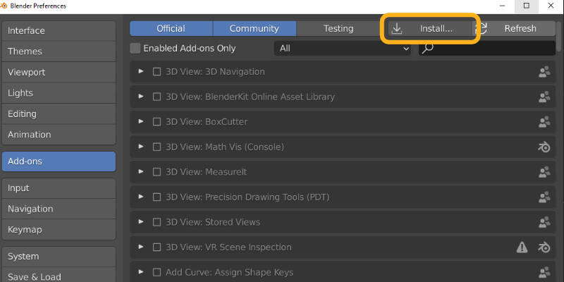
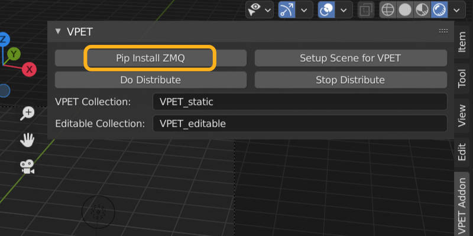
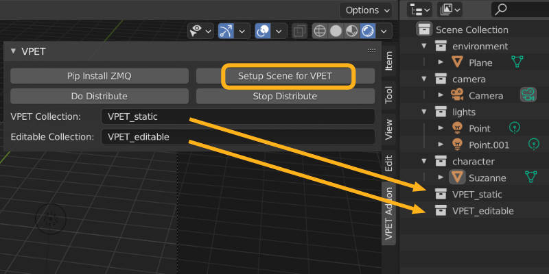
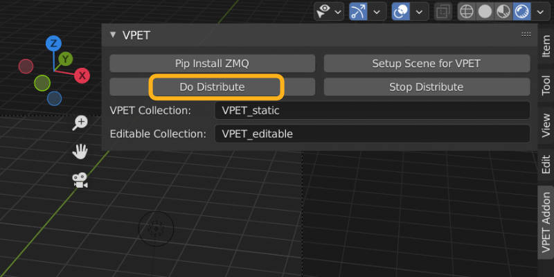

# VPET Unreal Plugin Quick Start
`version 0.1.1`

## Contents

1. [Install Addon](#enable-plugin)

 

## Install Addon

Install the Addon under *Preferences - Add-ons* and enable it.

## Install Zero MQ

Install Zero MQ to enable data transfer between Blender and the VPET Client(s). Please be aware that you have to have admin rights for this to work.

 

## Basic workflow

### Prepare VPET Collections

*Setup Scene for VPET* will create two collections for objects to be transfered to VPET. One collection for static objects, that can't be manipulated in VPET and one for the editable objects.

While you can create these collections manually it is recommended to use the button of the addon since on execution it will look for these exact collection names.

### Populate VPET Collections

The next step is to add the objects you want to send to VPET to the newly created collections.

It is recommended to *link* the objects (by Ctrl+dragging) to these new collections instead of *moving* them there in order to keep your View Layer hierarchy intact.

### Send Scene to VPET

Once you press the *Do Distribute* button, the VPET addon will start listening for requests from a VPET client on the network.

Make sure your mobile device is connected to the same network of your computer. Open the VPET mobile app, set the host (computer) IP address accordingly and click *load*.

For more information, refer to VPET's user guide. It is found under Docs, at our [repository](https://github.com/FilmakademieRnd/VPET) root.

### Synchronization Application

While the host can send the scene information to the tablet, an external application is needed for synchronizing changes between the client (or multiple clients) and the host server.

The SyncServer for the current build (win x64) will be found where you downloaded the [VPET repository](https://github.com/FilmakademieRnd/VPET), under

`...\SynchronisationServer\install_win64`

It requires command line arguments, so it should be launched from the command prompt (*cmd.exe*).

You can run the application by setting the **-ownIP** (case-sensitive) argument.

`Server.exe -ownIP 111.222.333.444`

### Stop Distribution

It is vital to remember pressing the *Stop Distribution* button once you are finished. This way the connections will be closed and the ports will be freed for your next VPET session.

## Useful information

For best display of your scene in the clients, your level should contain:

- At least one light of type direction, point or spot;

- At least one camera.

Although a camera is not mandatory, having one provides a starting point of view in your VPET client.