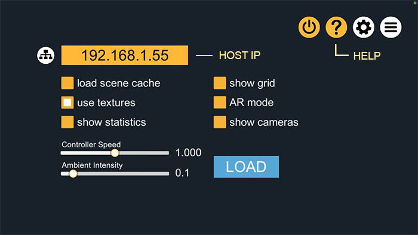
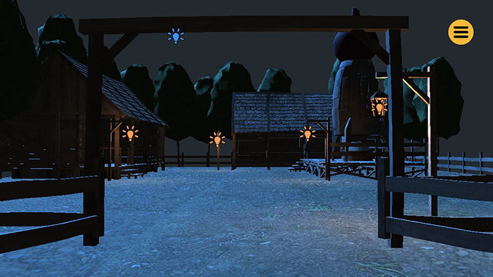
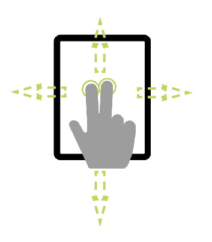
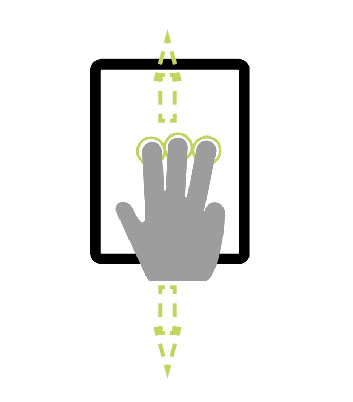
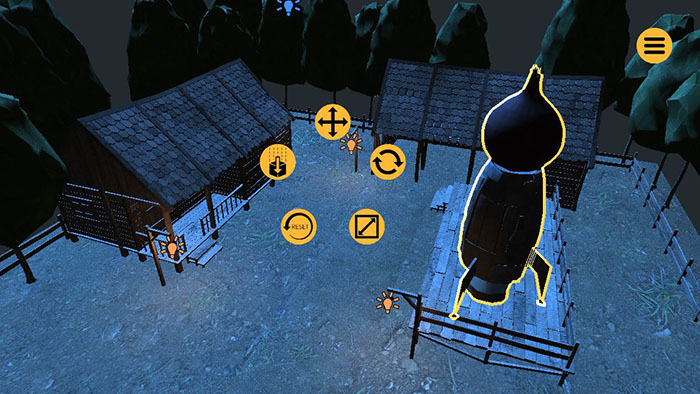

# VPET Client Quick Start

The VPET client application gives you the interface to interact with your scene.

## Installation

Download the free VPET app for your devices:

* [iOS - Apple App Store](https://apps.apple.com/de/app/vpet/id1374394388)
* [Android - APK file download](https://degas.filmakademie.de/nextcloud/index.php/s/6P2bLkpEjjKdZeC)
* [Windows - ZIP file download](https://apps.apple.com/de/app/vpet/id1374394388)

## Configuration

The app opens in the following configuration screen:

- **Host IP**  
  Enter the IP address of the scene host here.  
  This field is not relevant if loading scene from cache.

- **Load scene cache**  
  Loads a local cache scene, without the need of network.  
  It can be useful for familiarizing with the UI and functionalities.

- **Use textures**  
  Attempts to load textures together with scene geometry.  
  Might lead to slower performance.

- **Show statistics**  
  Displays additional information on performance and operations.

- **Show grid**  
  Overlays the scene with a horizontal plane grid.

- **AR mode**  
  Enables augmented reality mode, so that the scene is placed within the device's camera view.

- **Show cameras**  
  Display the cameras as visible objects in the virtual scene.

- **Controller speed**  
  Regulates the speed of scene navigation.

- **Ambient intensity**  
  Increases or decreases the amount of ambient light in the virtual scene.

**Note**: on-screen information can be displayed by clicking on the *`Help`* icon.

## Scene navigation

Once loaded, you should have a view of your scene as looking through one camera.

The virtual camera will automatically attempt to be tracked with your device.

Additionally, the view can be navigated by touch control.

Two-finger gestures up / down will control pedestal up / down, and by moving left / right, the camera will truck left / right.

With three fingertips touching the device, moving your fingers up / down allows you to move the camera forward (dolly in) / backward (dolly out).

## Object manipulation

Objects can be selected by touch.

The selected object (or chain of objects) will be visually highlighted with an outline overlay.

In the centre of the screen, a radial toolset will be display. This concentrates the main transformation tools like translation, rotation and scale.

Icons and gizmos follow the convention of most common digital content creating tools.

For more instructions, refer to the on-screen support available via the *`Help`* icon or the extended user guide.

## Extended documentation

A detailed user guide can be found under directory *`Docs`* at this repository's root. 

## Additional resources

* [Main repository](https://github.com/FilmakademieRnd/VPET)
* [VPET Web Site](http://vpet.research.animationsinstitut.de)
* [Youtube Playlist](https://www.youtube.com/embed/videoseries?list=PLFSxFMrrXJM4PNNejIBy3ztEnA0xYLBwl)

