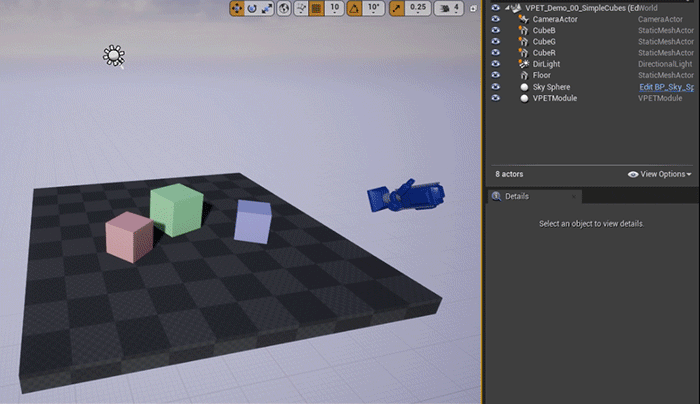
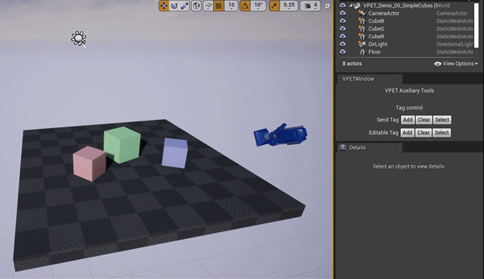
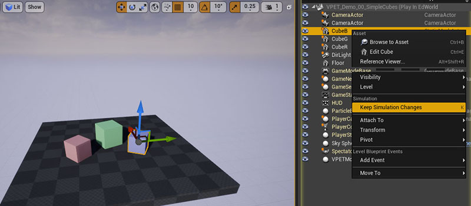

# VPET Unreal Plugin Quick Start
`version 0.1.1`

## Contents

1. [Enable plugin](#enable-plugin)
2. [Basic workflow](#basic-workflow)
    1. [Add and configure VPET](#add-and-configure-vpet)
    2. [Tagging](#tagging)
    3. [Send scene](#send-scene)
    4. [Synchronization application](#synchronization-application)
    5. [Keeping your changes](#keeping-your-changes)
3. [Useful information](#useful-information)
    1. [Custom classes](#custom-classes)
    2. [Material](#material)
    3. [Attachment chain](#attachment-chain)
    4. [Multi-user](#multi-user)
4. [Additional workflows](#additional-workflows)
    1. [Operation without tags](#operation-without-tags)
    2. [High-poly / low-poly variations](#high-poly-low-poly-variations)
5. [Settings explained](#settings-explained)


<br />

## Enable plugin

Make sure plugins are enabled.


VPET Window is **not** essential for operation.

If you plan on running your level inside the Editor, it is advisable to uncheck the option of reduced CPU usage, under *Editor Preferences*.


<br />

## Basic workflow

Level preparation is not complicated.

However, we advise starting with a basic set-up, before committing to a large scene[<sup>[1]</sup>](#1-starting-point).

---

### Add and configure VPET

Find and place the `VPETModule` actor in your level.


Configuration can be done under the Details tab.


It is **essential** to fill in your computer IP, related to the network shared with the client device(s)[<sup>[2]</sup>](#2-ip-configuration).


---

### Tagging

VPET uses actor tags as "instructions".

The most basic tag is `send` (not case sensitive), for all objects that **should** be made available in the VPET clients.
This includes geometry, lights and cameras.



If you want to be able to edit an actor - e.g. reposition or transform - it needs to have the `editable` tag.


**Note:** An editable object **has to be** set to *Moveable* in the editor, or it can not be transformed, and will generate mobility warnings.


---

#### Tagging helper

Since adding and removing tags over multiple objects can be cumbersome, an additional tool is provided via the plugin VPET Window.  
It creates an editor window with buttons to assist tagging.


Simply select the actors and use the buttons to apply the respective actions.



The window can be opened via the upper toolbar or the Window menu.


---

### Send scene

At this stage, you should be able to play or simulate your level and test if your clients can fetch it.

Make sure your mobile device is connected to the same network of your computer. Open the VPET mobile app, set the host (computer) IP address accordingly and click *load*.

The scene should load to your device. 


Make sure the *load scene cache* option is unticked.

If the progress bar loads fully but the screen is black, double check your tagging settings.

For more information, refer to VPET's user guide. It is found under Docs, at our [repository](https://github.com/FilmakademieRnd/VPET) root.

---

### Synchronization application

While the host can send the scene information to the tablet, an external application is needed for synchronizing changes between the client (or multiple clients) and the host server.

The SyncServer for the current build (win x64) will be found where you downloaded the [VPET repository](https://github.com/FilmakademieRnd/VPET), under

`...\SynchronisationServer\install_win64`

It requires command line arguments, so it should be launched from the command prompt (*cmd.exe*).

You can run the application by setting the **-ownIP** (case-sensitive) argument.

`Server.exe -ownIP 111.222.333.444`


Now, changes made on the client should also show up on the engine.


**Note:** The synchronization server should be restarted when you go back into edit mode and do modifications to your host scene.


---

### Keeping your changes

If you are working inside the Unreal Engine editor, you are able to keep the changes made through the clients before you leave the Play mode.

Just select the objects that you edited, and, in the outliner, right click and choose "Keep Simulation Changes". Alternatively, just use the `K` keyboard shortcut.  
For making this easier, if using the *VPET Window* plugin, you can select all the editable actors with one single button click.




<br />

## Useful information

For best display of your scene in the clients, your level should contain:

- StaticMesh components for your geometry;

- At least one light of type direction, point or spot;

- At least one camera.

Although a camera is not mandatory, having one provides a starting point of view in your VPET client.

---

### Custom classes


Currently, the VPET plugin works with the native classes for static meshes, lights and camera. Support for custom Blueprint classes is still under development.


For meshes, however, if you are using a blueprint actor that has a StaticMeshComponent and you want it to be available for VPET, you can attempt to send it adding the tag `mesh`.

---

### Material

Material support is implemented only in a very basic level.

VPET clients will display only solid color elements, all grey. If your material has as the input for its BaseColor a Constant3, Constant4 or Parameter, that color should be transmitted to the clients.


---

### Attachment chain

Actors attached under other actors should be transmitted normally.

**However**, objects attached under a camera will not be displayed in VPET

Attachments under light objects can lead to issues and has not been thoroughly tested.  
By default, actors attached to a light actor will not be sent. For overriding this option, tick the checkbox *Send light child*

---

### Multi-user
Do note that if several instances of the project are launched, all will attempt to bind ZMQ to the network address set as Host IP.  
This should not represent a problem with a single workstation, but do note that use across multiple computers would require 


<br />

## Additional workflows

As you might need more (or less) functionalities from VPET, you might have different ways to set up your level.

---

### Operation without tags

In the current release, we can force-ignore the tag systems for quickly testing communication and operation.

Under VPET Setting > Development, untick `Use Send tag` and `Use Editable tag`.


**Note:** This is not a recommended workflow.

---

### High-poly / low-poly variations

Mobile devices and workstations operate on different levels of computing power.

So it might be useful to have high-poly geometry running on your engine, but not on your mobile client.

You can have a low poly object acting as proxy geometry for the tablet, even for editable objects.

---

#### Static objects

For static objects, all is needed is to only add the tag `send` to the lower resolution geometry, so the high res one will be disregarded.

You will likely also want to set the low resolution visibility so it appears on the clients, but not on the Unreal Engine instances.

```
Root
  High poly object - no tags, does not get sent to client, is displayed in the game
  Low poly object - tagged 'send', goes to client, is set to be hidden in the game
```

---

#### Editable objects

For having a high-resolution model dynamic, it can be attached, together with its low-res counterpart, to an empty "dummy" actor.  
The empty actor should be set as `editable`. The child should have the `send` tag, but not the editable one.

With that setup, a proxy geometry will drive the parent actor.

```
Root
  Empty actor - tagged 'send' and 'editable'
    High poly object - no tags, does not get sent to client, is displayed in the game
    Low poly object - tagged 'send', goes to client, is set to be hidden in the game
```


The expected behaviour is having a low poly geometry that acts as selection placeholder for your high-quality asset.


---

#### Visibility helper

For assisting this setup without having to navigate through the Details tab, the VPET Window helper also provide buttons for easily changing the rendering visibility (*Hidden in Game* property) of selected actors.


<br />

## Settings explained

### Light settings
- **Brightness multiplier** - multiplying factor between the light brightness values in Unreal Engine and VPET, in case VPET scene looks too bright or too dark
- **Range multiplier** - multiplying factor between the light brightness values in Unreal Engine and VPET, in case VPET scene looks too bright or too dark
- **Send light child** - choose to send or not actors attached under a light actor

### Development
- **Use Send tag** - either send to clients only tagged actors, or send all that are possible
- **Use Editable tag** - either marks as editable only actors with tag, or all moveable objects will be editable
- **Verbose display** - renders on-screen debug messages of some operations (particularly useful outside of editor, e.g. running under nDisplay)
- **Logging** 
  - **Log basic** - essential operations like opening the ZMQ socket and preparing which actors to build.
  - **Log material** - development logs for accessing material information


---

<br />

### Footnotes

#### 1. Starting point

Alternatively, one can use the [provided test scene](../../../raw/master/SceneDistribution_Unreal/VPET_DemoContent.zip) or test running the application with the scene you have [without further set-up](#operation-without-tags).

[<sup>^ back</sup>](#basic-workflow)


#### 2. IP Configuration
If you **do not** know this information:
- Open a command prompt typing "cmd" at the Start Menu
- Enter "ipconfig"
- Find the respective IPv4 address


[<sup>^ back</sup>](#add-and-configure-vpet)