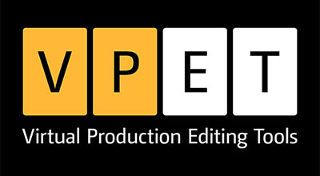
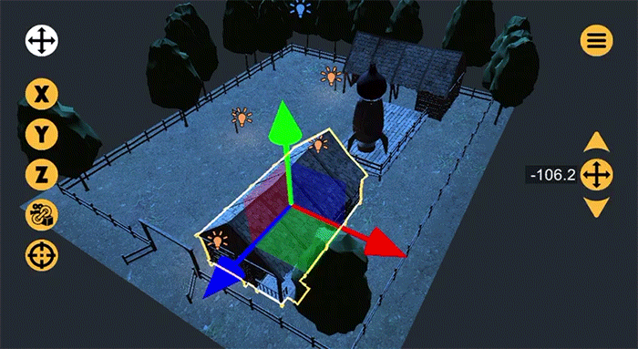

# VPET - Virtual Production Editing Tool

**VPET web site:** [vpet.research.animationsinstitut.de](http://vpet.research.animationsinstitut.de)

## Description

VPET is a collaborative tool that allows realtime scene editing via an intuitive interface.

It takes a holistic approach on light, asset and animation editing, for virtual production environments.

Its development is open-source, with growing support for diverse film and VFX pipelines.

## Repository Content

- **SynchronisationServer**  
(a.k.a. SyncServer)  
Application for maintaining synchronization between the host server (computer) and VPET clients (mobile devices)  
<!--[Quick intro]()-->

- [**VPET_Unity**](VPET_Unity)  
Unity project and assets for using Unity as a VPET host application  
(Note: also contains the source application for the VPET clients)  
[Tutorial video](https://youtu.be/XlwlEHVnbbI?list=PLFSxFMrrXJM4PNNejIBy3ztEnA0xYLBwl)

- [**SceneDistribution_Unreal**](SceneDistribution_Unreal)  
Plug-in for using Unreal Engine as a VPET host application  
[Teaser video](https://youtu.be/ROlDiYnoEPc?list=PLFSxFMrrXJM4PNNejIBy3ztEnA0xYLBwl)  
[Quick-start guide](.doc/VPET_Unreal_Quickstart.md)

- [**SceneDistribution_Katana**](SceneDistribution_Katana)  
Application for distributing a Katana scene to VPET mobile clients  
Synchronization is supported  
[Tutorial video](https://youtu.be/z3BAYGiIeC8?list=PLFSxFMrrXJM4PNNejIBy3ztEnA0xYLBwl)

- [**SceneDistribution_USD**](SceneDistribution_USD)  
Application for distributing USD files to VPET mobile clients  
Note: does not support realtime synchronization  

- **Docs**  
VPET user guide and additional documentation  

## VPET Client App

### Installation

Download the free VPET app for your devices:

* [iOS - Apple App Store](https://apps.apple.com/de/app/vpet/id1374394388)
* [Android - APK file download](https://github.com/FilmakademieRnd/VPET/releases/download/VPET_Android/vpet.apk)
* [Windows - ZIP file download](https://github.com/FilmakademieRnd/VPET/releases/download/VPET/VPET_Win_x64.zip)

Note: The client app was developed with Unity Engine and can be custom built for specific needs.  
The Unity project can be found under the *VPET_Unity* directory.

### How to use it

For an introduction, refer to our [quick-start guide](.doc/VPET_Client_Quickstart.md).

A detailed user guide can be found under directory *Docs*. 

## VPET Host Applications

For previsualization of scenes, Katana projects and USD files are supported.

For realtime scene editing, Unity and Unreal are supported.

### Installation

Clone or [download](https://github.com/FilmakademieRnd/VPET/archive/master.zip) this repository.

Navigate to the directory corresponding to your application of choice.

Follow the respective documentation:

- Katana  
[Tutorial video](https://youtu.be/z3BAYGiIeC8?list=PLFSxFMrrXJM4PNNejIBy3ztEnA0xYLBwl)

- USD  
[Read-me](SceneDistribution_USD)

- Unity  
[Tutorial video](https://youtu.be/XlwlEHVnbbI?list=PLFSxFMrrXJM4PNNejIBy3ztEnA0xYLBwl)

- Unreal  
[Quick-start guide](.doc/VPET_Unreal_Quickstart.md)

## Additional resources

* [VPET Web Site](https://animationsinstitut.de/en/research/tools/vpet)
* [Presentation Video](https://youtu.be/6FssNOPKcnc)
* [VPET Youtube Playlist](https://www.youtube.com/embed/videoseries?list=PLFSxFMrrXJM4PNNejIBy3ztEnA0xYLBwl)

## About

VPET is a development by Filmakademie Baden-Wuerttemberg, Animationsinstitut R&D Labs in the scope of the EU funded Project Dreamspace (610005),  
the EU funded project  SAUCE (780470) and funds on the own behalf of Filmakademie Baden-Wuerttemberg.

## License
VPET is a open-sorce development by Filmakademie Baden-Wuerttemberg's Animationsinstitut.  
The client is licensed under MIT. All other parts have dedicated Filmakademie licenses. See [License file](LICENSE.TXT) for more details.