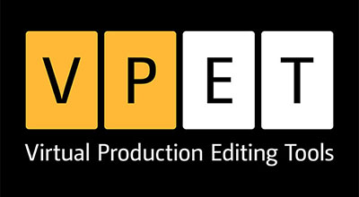

# VPET - Virtual Production Editing Tools

VPET is a collaborative tool that allows realtime scene editing via an intuitive interface. 
It takes a holistic approach on light, asset and animation editing, for virtual production environments. 
Its development is open-source, with growing support for diverse film and VFX pipelines.

## Ressources

**[VPET web page](https://research.animationsinstitut.de/vpet)**

**[Youtube Playlist](https://youtube.com/playlist?list=PLFSxFMrrXJM4PNNejIBy3ztEnA0xYLBwl&si=vo2MEp1s8D7_EUJP)**

## VPET Client App

Download the free VPET app for your devices:

* [iOS - Apple App Store](https://apps.apple.com/de/app/vpet/id1374394388)
* [Android - APK file](https://github.com/FilmakademieRnd/VPET/releases/download/VPET_Android/vpet.apk)
* [Windows - ZIP File](https://github.com/FilmakademieRnd/VPET/releases/download/VPET/VPET_Win_x64.zip)

Note: The client app was developed with Unity Engine and can be custom built for specific needs.  
The Unity project can be found under the *VPET_Unity* directory.

### How to use it

For an introduction, refer to our [quick-start guide](.doc/VPET_Client_Quickstart.md).
A detailed user guide can be found under directory *Docs*. 

## About

VPET is a development by Filmakademie Baden-Wuerttemberg, Animationsinstitut R&D Labs in the scope of the EU funded Projects MAX-R (101070072), SAUCE (780470), Dreamspace (610005) and funds on the own behalf of Filmakademie Baden-Wuerttemberg.

## Funding

This project has received funding from the European Union's Horizon Europe Research and Innovation Programme under Grant Agreement No 101070072 MAX-R.
This project has received funding from the European Union’s Horizon 2020 Research and Innovation Programme under Grant Agreement No 780470 SAUCE.
This research has received funding from the European Commission’s Seventh Framework Programme under grant agreement no 610005 DREAMSPACE.

## License
VPET is a open-sorce development by Filmakademie Baden-Wuerttemberg's Animationsinstitut.  
The client is licensed under MIT and includes libraries under other Open Source and proprietary licenses. See [License file](LICENSE.TXT) for more details.
