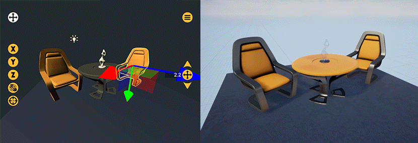

# VPET for Unreal

VPET plug-in for the Unreal Engine 4.

<!--

-->

**Demonstration video:** [https://youtu.be/ROlDiYnoEPc](https://youtu.be/ROlDiYnoEPc?list=PLFSxFMrrXJM4PNNejIBy3ztEnA0xYLBwl)

## Description

VPET allows for real-time manipulation and scene editing through a mobile client.

This plug-in allows using Unreal Engine as a host application.

Note: This plug-in is still in early development.

## Installation

You can either use provided pre-built binaries or build the plug-in on your own.

### Pre-built binaries

Download the latest pre-built binaries in the [`Releases`](../../../releases/) section of this repository.

Simply extract the `Plugins` folder to your UE project folder.

### Building the plug-in 

Copy the `Plugins` folder to your UE project folder.

In launching the project, you will be prompt to build the missing plugins.

In case of failure or in need of custom modification, you might require Visual Studio and a C++ code project.  
If you are new to programming in UE4, refer to the official [documentation](https://docs.unrealengine.com/latest/INT/Programming/index.html).

**Note**: This plug-in has modules that build upon a third-party library from ZMQ.  
All necessary files are provided, but custom builts might need adaptation.  
Module additional libraries and include paths are described in `\Plugins\VPET\Source\libzmq\libzmq.Build.cs`.

#### Using it as an Engine plug-in

If you do not want to associate the VPET plugin with a specific project, it can be installed as an engine plugin.  
Follow the installation procedure above, but instead of placing the folders at your project directory, put them into your engine installation path, e.g.:

`%ProgramFiles%\Epic Games\UE_4.26\Engine\Plugins\VirtualProduction`

## Usage

For introductory instructions, please refer to our [quick-start guide](../.doc/VPET_Unreal_Quickstart.md).

## Content

Currently two separate plug-ins are provided:

- `VPET` - the *actual* plug-in. It implements the class **VPETModule**, an object that 
handles scene distribution and synchronization;

- `VPETWindow` - an editor extension for assisting scene setup.

An example minimal scene is also provided for quick testing: [`VPET_DemoContent.zip`](../../../raw/main/SceneDistribution_Unreal/VPET_DemoContent.zip)

## Supported Platforms

This plug-in was built against versions **4.23**, **4.24**, **4.25** and **4.26**
only under **Windows x64** platform.

Further support will be available in the coming revisions.

## Additional tools

For synchronization between clients (tablets, phones...) and host (Unreal Engine),
the side tool **SyncServer** is needed.

Refer back to repository root for more information.

## Dependencies

Currently release includes needed pre-built libraries and should work out of the box.

## Network requirements

The host computer (running Unreal Engine) and the client devices must be connected to 
a same network and able to reach each other.

Communication happens via ØMQ (ZeroMQ) over ports **5556** and **5565**.

## Additional resources

* [Quick-start guide](../.doc/VPET_Unreal_Quickstart.md)
* [Main repository](https://github.com/FilmakademieRnd/VPET)
* [VPET Web Site](https://animationsinstitut.de/en/research/tools/vpet)
* [Youtube Playlist](https://www.youtube.com/embed/videoseries?list=PLFSxFMrrXJM4PNNejIBy3ztEnA0xYLBwl)
* [Free Apple App Store VPET Client](https://apps.apple.com/de/app/vpet/id1374394388)

## License

Please review the [License file](LICENSE.TXT).